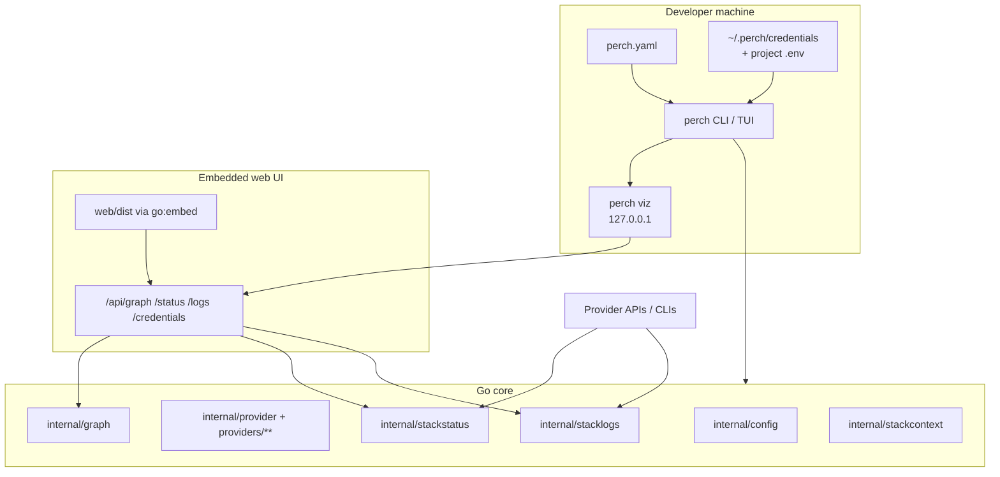
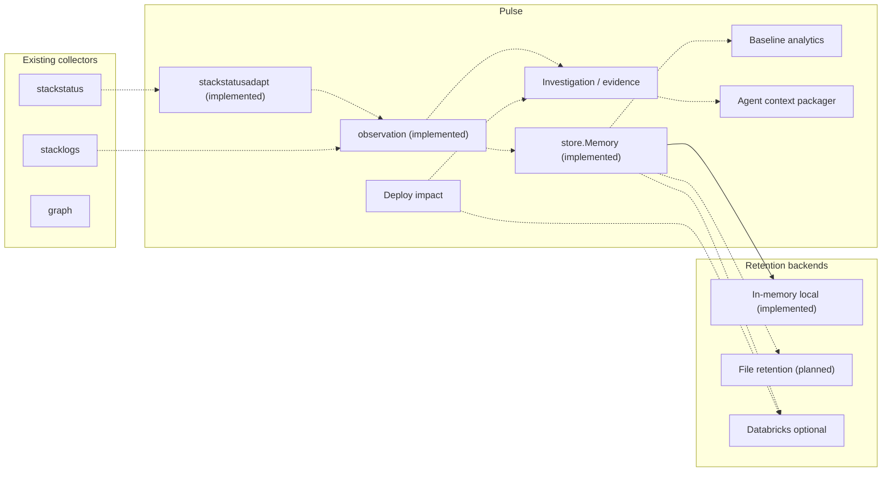

# Architecture — current Perch vs proposed Pulse

Separate **what exists today** from **proposed Pulse modules**. Proposed sections are forward design only; do not treat them as implemented.

## Part A — Current architecture (imported Perch)

### Overview

Go CLI + optional embedded React SPA. Reads `perch.yaml`, loads embedded provider YAML, builds a dependency graph, probes health when credentials allow, and resolves logs through an ordered credential strategy chain. No Perch cloud service.

### Module ownership (today)

| Area | Path | Responsibility |
|------|------|----------------|
| Entrypoint | `cmd/perch` | Binary → `cli.Execute` |
| CLI | `internal/cli` | Cobra commands, viz HTTP server |
| Config | `internal/config` | Load/validate `perch.yaml` |
| Providers | `providers/`, `internal/provider`, `internal/providerspec` | Specs, registry, validation |
| Graph | `internal/graph` | Environment topology |
| Status | `internal/stackstatus`, `internal/customstatus` | Probes + custom shell health |
| Logs | `internal/stacklogs`, `internal/customlogs` | Credential chain + fetch |
| Context | `internal/stackcontext`, `internal/llm` | Merged / agent summaries |
| Credentials | `internal/credentials` | Local store + `.env` sync |
| TUI | `internal/tui` | Bubbletea UI |
| Web | `web/`, `web/embed.go` | Vite React app embedded for viz |

### Data flow (today)

1. Discover `perch.yaml` from CWD upward.
2. Load provider registry (embed or `PERCH_PROVIDERS_DIR`).
3. Build graph for `--env`.
4. Collect status/logs via provider APIs, CLIs, or custom shell—with timeouts where implemented.
5. Serve the same collectors over localhost for the SPA, or print JSON/TUI for humans/agents.

### Runtime constraints

- Viz binds to loopback; credentials stay on the machine.
- `//go:embed` requires `web/dist` before Go packages importing `web` compile (`npm run build:embed`).
- Status/logs are **point-in-time**, not warehouse history.

See [`CODEBASE_GUIDE.md`](CODEBASE_GUIDE.md) for flows and known bug surfaces.

---

## Part B — Pulse architecture

Keep Pulse modular and optional relative to Part A. Prefer packages under `internal/pulse/...` over overloading `stackstatus`.

### Implemented

| Module | Path | Intent |
|--------|------|--------|
| Observation contract | `internal/pulse/observation` | Typed service signal with explicit timestamps and derived freshness (`IsStale` / `EffectiveStatus`). No I/O. |
| Stack status adapter | `internal/pulse/stackstatusadapt` | Pure mapping from `stackstatus.NodeReport` / `EnvReport` into observations; does not change live collectors. |
| Local observation store | `internal/pulse/store` | Process-local `Memory` history behind a `Store` interface (`Append` / `List` / `Latest`); no Databricks. |
| Astronomy Shop mapping | `internal/pulse/astronomy` | Phase 2 local target identity map (`astronomy/<env>/<name>`) for OpenTelemetry Demo pin 3.1.0; no runtime collectors. |

Phase 2 local target setup (docs/scripts, not a collector): [`astronomy-shop.md`](astronomy-shop.md), [`examples/astronomy-shop/`](../examples/astronomy-shop/).

### Proposed (not implemented)

Solid edges mark implemented package relationships that already exist in-tree
(`store.Memory` backs `Store`). Dashed edges are planned callers/integration
(not yet wired into CLI/`perch status`).

| Module | Intent | Databricks |
|--------|--------|------------|
| Evidence / investigation | Assemble citations from collectors + topology | Not required for assembly |
| Baselines / analytics | Compare current signals to stored history | Optional amplify |
| File retention backend | Durable local persistence implementing `store.Store` | Not required |
| Deploy impact | Correlate deploys with health/log shifts | Optional for large joins |
| Agent context packager | Stable schemas; evidence vs inference | Not required |
| Databricks backend | Warehouse-scale analytics | **Optional only** |

### Integration rules

1. Part A collectors remain the live local source of truth.
2. Pulse consumes collector outputs; it does not replace `perch.yaml` or provider YAML.
3. Unset optional backends → explicit unavailable semantics, never fake-healthy status.
4. Do not implement these modules in Phase 0.

---

## Part C — Verification architecture

| Concern | Mechanism |
|---------|-----------|
| Local gate | `make verify` |
| PR / main gate | `.github/workflows/ci.yml` → `make verify` |
| Release | `.github/workflows/release.yml` (unchanged; no deploy from Phase 0) |

Agents treat `make verify` as the definition of “buildable.”
