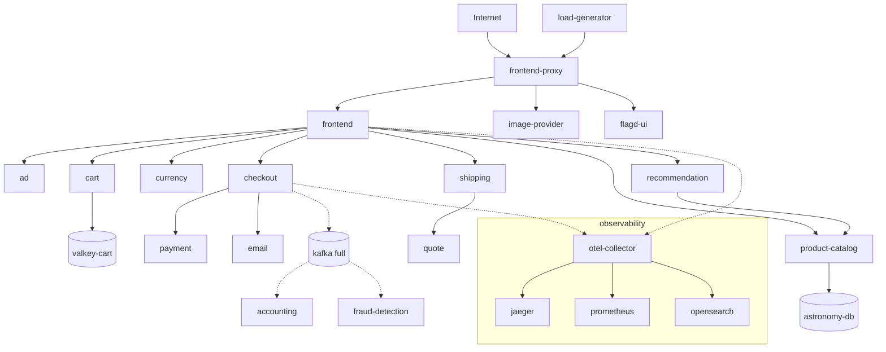

# OpenTelemetry Astronomy Shop (Phase 2 target)

This document establishes the [OpenTelemetry Astronomy Shop](https://opentelemetry.io/docs/demo/) as the **local Phase 2 target application** for Perch Pulse.

**Scope of this doc:** reproducible local setup, actual service topology, telemetry surfaces, Perch/Pulse service-ID mapping, and the ground-truth scenario harness.  
**Out of scope:** anomaly/regression detection, Databricks, Pulse UI, and changes to observation/store semantics.

Machine-readable mapping: [`internal/pulse/astronomy/service-mapping.yaml`](../internal/pulse/astronomy/service-mapping.yaml)  
Helper scripts: [`examples/astronomy-shop/`](../examples/astronomy-shop/)

## Pin and upstream

| Field | Value |
|-------|-------|
| Upstream | https://github.com/open-telemetry/opentelemetry-demo |
| Git pin | **3.1.0** |
| Official docs | https://opentelemetry.io/docs/demo/ |
| Docker guide | https://opentelemetry.io/docs/demo/docker_deployment/ |
| Architecture | https://opentelemetry.io/docs/demo/architecture/ |

The demo is **not vendored** into perch-pulse. Scripts clone the pinned tag into a gitignored local directory (or `$PERCH_ASTRONOMY_DEMO_DIR`).

## Prerequisites

- Docker and Docker Compose **v2**
- Make (optional; scripts call `make` when available)
- Resources (from upstream docs):
  - **Minimal mode (recommended):** ~3 GB RAM
  - **Full mode:** ~6 GB RAM, ~14 GB disk
- No cloud credentials and **no Databricks** required

> Local load-generator traffic is **synthetic** and must not be treated as production scale.

## Quick start (reproducible)

From the perch-pulse repo root:

```bash
# Clone pin 3.1.0 (once)
./examples/astronomy-shop/scripts/clone.sh

# Start minimal + observability backends (Jaeger / Prometheus / OpenSearch / Grafana)
./examples/astronomy-shop/scripts/start.sh

# Health + topology checks (frontend, containers, optional Jaeger services)
./examples/astronomy-shop/scripts/verify-live.sh

# Stop (containers only; Compose volumes are preserved — unlike upstream `make stop`)
./examples/astronomy-shop/scripts/stop.sh
```

Equivalent upstream commands (after clone):

```bash
cd "$PERCH_ASTRONOMY_DEMO_DIR"   # default: examples/astronomy-shop/.demo
make start-minimal               # or: make start  (full + Kafka group)
```

### URLs (default `ENVOY_PORT=8080`)

| Surface | URL |
|---------|-----|
| Web store (frontend via Envoy) | http://localhost:8080/ |
| Load generator UI | http://localhost:8080/loadgen/ |
| Feature flags UI | http://localhost:8080/feature/ |
| Telemetry docs | http://localhost:8080/telemetry/ |
| Jaeger UI | http://localhost:8080/jaeger/ui/ |
| Grafana | http://localhost:8080/grafana/ |
| OpAMP UI | http://localhost:8080/opamp/ |

### Deployment modes (upstream)

| Mode | Make target | Notes |
|------|-------------|-------|
| Minimal + o11y (default here) | `make start-minimal` | No Kafka / accounting / fraud-detection |
| Full + o11y | `make start` | Adds Kafka group |
| Agentic | `make start-agentic` | Adds agent / mcp / chatbot |
| No observability | `make start-minimal-no-o11y` | Shop only; no Jaeger/Grafana/… |

## Service topology (pin 3.1.0)

Topology below follows the official [Demo Architecture](https://opentelemetry.io/docs/demo/architecture/) and compose files at tag `3.1.0`. Names are **OTEL service names** unless noted.

### Externally visible (via `frontend-proxy` / Envoy)

- **frontend-proxy** — single ingress on `:8080`
- **frontend** — web store (HTTP behind proxy)
- **frontend-web** — browser client resource (`WEB_OTEL_SERVICE_NAME`)
- **load-generator** — Locust UI at `/loadgen/`
- **flagd-ui** — feature flags at `/feature/`
- **telemetry-docs** — `/telemetry/`
- Observability UIs: **grafana**, **jaeger**, **opamp-server** (infra; proxied)
- Agentic only: **chatbot** at `/chatbot/`

### Internal application services

| Service | Language (docs) | Primary dependencies |
|---------|-----------------|----------------------|
| ad | Java | flagd |
| cart | .NET | valkey-cart, flagd |
| checkout | Go | cart, currency, payment, email, product-catalog, shipping, flagd; Kafka in full mode |
| currency | C++ | — |
| email | Ruby | — |
| payment | JavaScript | flagd |
| product-catalog | Go | astronomy-db (PostgreSQL) |
| quote | PHP | — |
| recommendation | Python | product-catalog, flagd |
| shipping | Rust | quote |
| image-provider | NGINX | — |
| flagd | OpenFeature | — |

### Full-mode messaging path

- **checkout** → **kafka** → **accounting**, **fraud-detection**
- **accounting** also uses **astronomy-db**

### Supporting infrastructure

| Component | Role |
|-----------|------|
| otel-collector | OTLP ingest; export to backends |
| jaeger | Traces |
| prometheus | Metrics |
| opensearch | Logs |
| grafana | Dashboards |
| opamp-server | Collector management UI |
| astronomy-db | PostgreSQL |
| valkey-cart | Cart cache |
| kafka | Orders queue (full mode) |



## Telemetry surfaces

All instrumented services export **OTLP** to **otel-collector** (`4317` gRPC / `4318` HTTP). With observability compose layers:

| Signal | Path | Where to look locally |
|--------|------|------------------------|
| Traces | services → collector → **Jaeger** | http://localhost:8080/jaeger/ui/ |
| Metrics | services → collector → **Prometheus** (incl. spanmetrics) | Grafana http://localhost:8080/grafana/ |
| Logs | services → collector → **OpenSearch** | Grafana / OpenSearch |

Collector OpAMP status: http://localhost:8080/opamp/

### Service names expected in telemetry

From compose `OTEL_SERVICE_NAME` / `WEB_OTEL_SERVICE_NAME` at pin 3.1.0:

`ad`, `cart`, `checkout`, `currency`, `email`, `frontend`, `frontend-web`, `frontend-proxy`, `image-provider`, `load-generator`, `payment`, `product-catalog`, `quote`, `recommendation`, `shipping`, `flagd`, `flagd-ui`, `telemetry-docs`, and in full mode `accounting`, `fraud-detection`, `kafka`; agentic adds `agent`, `mcp`, `chatbot`.

Resource attribute namespace: `service.namespace=opentelemetry-demo`.

## Perch / Pulse service-ID mapping

**Convention (ADR-009):**

```text
astronomy/<environment>/<name>
```

- `<environment>` for Docker Compose local runs: **`local`**
- `<name>` for app/supporting emitters: exact **`OTEL_SERVICE_NAME`** (or `frontend-web`)
- Infrastructure without a demo OTEL service name: **`infra/<component>`**

Examples:

| OTel / component | Pulse `service_id` |
|------------------|--------------------|
| frontend | `astronomy/local/frontend` |
| checkout | `astronomy/local/checkout` |
| frontend-web | `astronomy/local/frontend-web` |
| otel-collector | `astronomy/local/infra/otel-collector` |
| jaeger | `astronomy/local/infra/jaeger` |

Properties:

- Deterministic and collision-resistant vs ordinary Perch env graphs (`production/api`)
- Compatible with `observation.Observation.ServiceID` / `store` (opaque non-empty string)
- Distinguishes app vs infra via the `infra/` segment
- Does **not** change observation freshness or store semantics

Authoritative table: `internal/pulse/astronomy/service-mapping.yaml` (validated in `go test ./internal/pulse/astronomy/...`).

Optional Perch graph for localhost probes: [`examples/astronomy-shop/perch.yaml`](../examples/astronomy-shop/perch.yaml).

## Ground-truth scenario harness

Controlled, reversible faults (and one negative control) are applied via the demo **flagd** feature flags — no Astronomy Shop fork. Typed records (`pulse.scenario.v1`) live in `internal/pulse/scenario` and are persisted under `examples/astronomy-shop/scenarios/results/` (gitignored). Labels must not be mixed into Pulse observations.

| Scenario ID | Failure mode | Flag | Active variant |
|-------------|--------------|------|----------------|
| `latency-shipping-intl` | latency | `intlShippingSlowdown` | `10sec` |
| `error-payment` | error rate | `paymentFailure` | `50%` |
| `outage-payment` | dependency outage | `paymentUnreachable` | `on` |
| `control-emit-raw-pii` | neutral (control) | `emitRawPii` | `on` |

```bash
./examples/astronomy-shop/scenarios/scenario.sh list
./examples/astronomy-shop/scenarios/scenario.sh start error-payment
./examples/astronomy-shop/scenarios/scenario.sh stop
./examples/astronomy-shop/scenarios/verify-scenarios.sh   # live; not in CI
```

See [`examples/astronomy-shop/scenarios/README.md`](../examples/astronomy-shop/scenarios/README.md) and ADR-010.

## Baseline detector evaluation

Telemetry-only detection (Prometheus spanmetrics p99 latency + error/call rates → rolling median baseline) with evaluation against scenario ground truth **after** each run:

```bash
./examples/astronomy-shop/eval/run-detector-eval.sh
```

See [`examples/astronomy-shop/eval/README.md`](../examples/astronomy-shop/eval/README.md) and ADR-012. Packages: `internal/pulse/telem`, `internal/pulse/detect` (no scenario import), `internal/pulse/evaluate`.

## Change / deployment correlation

Typed change events + incident evidence snapshots + deterministic correlation (ADR-013). Demo markers are **simulated** (not real cloud deploys):

```bash
./examples/astronomy-shop/change/deploy-marker.sh astronomy/local/payment abc123
./examples/astronomy-shop/eval/run-change-eval.sh
```

Packages: `internal/pulse/change`, `internal/pulse/incident`, `internal/pulse/correlate` (no scenario import), `internal/pulse/changeeval`. CLI: `perch pulse change-record|changes|incident|context`.

## CI vs live verification

| Check | Where |
|-------|--------|
| Mapping schema, uniqueness, required services, observation compatibility | `go test ./internal/pulse/astronomy/...` (part of `make verify`) |
| Scenario schema, lifecycle, label separation, secrets | `go test ./internal/pulse/scenario/...` (part of `make verify`) |
| Detector baseline/findings/attribution + evaluator metrics | `go test ./internal/pulse/detect/... ./internal/pulse/evaluate/...` (part of `make verify`) |
| Change/incident/correlate + changeeval fixtures | `go test ./internal/pulse/change/... ./internal/pulse/incident/... ./internal/pulse/correlate/... ./internal/pulse/changeeval/...` (part of `make verify`) |
| Clone + `make start-minimal` + frontend/Jaeger | `./examples/astronomy-shop/scripts/verify-live.sh` (**not** in CI; Docker-heavy) |
| Start/stop each catalog scenario + recovery | `./examples/astronomy-shop/scenarios/verify-scenarios.sh` (**not** in CI) |
| Full detector eval vs ground truth | `./examples/astronomy-shop/eval/run-detector-eval.sh` (**not** in CI) |
| Change correlation eval (simulated markers) | `./examples/astronomy-shop/eval/run-change-eval.sh` (**not** in CI) |

If live verify cannot run (Docker down, insufficient disk/RAM), the script exits non-zero with a clear reason. That does not fail `make verify`.

### Scenario harness live verification — completed 2026-10-09

Reused the already-running minimal stack (no rebuild). `./examples/astronomy-shop/scenarios/verify-scenarios.sh` with 15s dwell:

| Scenario | Activation | Recovery | Notes |
|----------|------------|----------|-------|
| `latency-shipping-intl` | PASS via flagd (`intlShippingSlowdown=10sec`) | PASS → `off` | detector uses Prom p99 latency |
| `error-payment` | PASS (`paymentFailure=50%`) | PASS → `off` | same |
| `outage-payment` | PASS (`paymentUnreachable=on`) | PASS → `off` | same |
| `control-emit-raw-pii` | PASS (`emitRawPii=on`) | PASS → `off` | negative control; labeled change, not a fault |

Post-run: all four flags idle (`off`). Prometheus healthy; ground-truth JSON under `scenarios/results/` (gitignored). Free disk ~25–26 GiB during run.

### Live verification (this machine / PR) — completed 2026-10-09

Earlier attempts were blocked by host disk exhaustion and Docker Desktop virtiofs bind-mount `input/output error` restart loops on observability configs (see git history / prior PR comments). After Docker Desktop **Clean / Purge** and a successful operator start of `make start-minimal`, live checks passed on this host:

| Check | Result |
|-------|--------|
| `./examples/astronomy-shop/scripts/verify-live.sh` | **PASS** (exit 0); frontend HTTP 200; required containers running |
| Frontend | `http://127.0.0.1:8080/` reachable |
| Major shop services | Running; healthchecks healthy where defined (`frontend`, `checkout`, `product-catalog`, `payment`, …) |
| OTEL collector | Running; exporting traces/metrics/logs (debug exporter shows continuous spans) |
| Jaeger | UI `200`; services API at `/jaeger/ui/api/services` listed shop names including `frontend`, `frontend-web`, `checkout`, `cart`, `payment`, `product-catalog`, … (17 names). Matches mapping OTEL names for minimal mode (only `flagd-ui` absent from Jaeger at verify time — UI may be lightly traced). |
| Prometheus | `/-/healthy` OK; **321** metric names via OTLP (not empty scrape targets); e.g. `demo_ad_requests_total`, `http_server_*`; `service_name` labels include mapped shop services |
| OpenSearch | Cluster up (single-node **yellow**); index `otel-logs-2026-10-09` with thousands of docs. Collector occasionally logs upstream `mapper_parsing_exception` drops for some attribute shapes — path is live; not all records index cleanly |

`verify-live.sh` default Jaeger URL was corrected to `/jaeger/ui/api/services` (Envoy mounts the UI under `/jaeger/ui/`).

Free disk at verify time: ~29 GiB. Stack was **not** restarted for verification.

Mapping accuracy was also cross-checked against pinned compose at tag **3.1.0**; live Jaeger names are a subset of that table (no unexpected shop service names).

## Secrets and safety

- Do **not** commit `.env.override`, API keys, or real credentials
- Upstream demo `.env` contains **public demo** DB passwords; leave them in the cloned demo tree only
- perch-pulse mapping/docs contain **no** passwords or tokens
- Do not point production credentials at this demo

## Remaining risks

- Upstream `DEMO_VERSION=latest` image tags may move even when git is pinned to 3.1.0
- Disk/RAM requirements can block first-time pulls on constrained machines
- Docker Desktop VM disk corruption after host disk-full events can leave the engine unresponsive, or leave virtiofs bind mounts returning `input/output error` even when `docker info` works (mitigated here by Clean/Purge + successful live verify; agent scripts still bound `docker info` with a timeout and fail fast on restart loops)
- Feature-flag scheduler in newer demo versions can change failure modes without Perch involvement
- React Native app is documented upstream but is not part of the default Compose shop path used here
- `examples/astronomy-shop/scripts/stop.sh` deliberately does **not** wipe volumes; use upstream `make stop` only when intentional data wipe is desired
