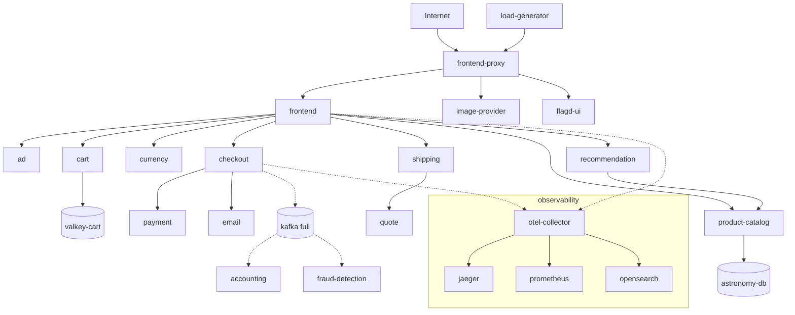

# OpenTelemetry Astronomy Shop (Phase 2 target)

This document establishes the [OpenTelemetry Astronomy Shop](https://opentelemetry.io/docs/demo/) as the **local Phase 2 target application** for Perch Pulse.

**Scope of this doc:** reproducible local setup, actual service topology, telemetry surfaces, and Perch/Pulse service-ID mapping.  
**Out of scope:** fault injection, anomaly/regression detection, Databricks, Pulse UI, and changes to observation/store semantics.

Machine-readable mapping: [`internal/pulse/astronomy/service-mapping.yaml`](../internal/pulse/astronomy/service-mapping.yaml)  
Helper scripts: [`examples/astronomy-shop/`](../examples/astronomy-shop/)

## Pin and upstream

| Field | Value |
|-------|-------|
| Upstream | https://github.com/open-telemetry/opentelemetry-demo |
| Git pin | **3.1.0** |
| Official docs | https://opentelemetry.io/docs/demo/ |
| Docker guide | https://opentelemetry.io/docs/demo/docker_deployment/ |
| Architecture | https://opentelemetry.io/docs/demo/architecture/ |

The demo is **not vendored** into perch-pulse. Scripts clone the pinned tag into a gitignored local directory (or `$PERCH_ASTRONOMY_DEMO_DIR`).

## Prerequisites

- Docker and Docker Compose **v2**
- Make (optional; scripts call `make` when available)
- Resources (from upstream docs):
  - **Minimal mode (recommended):** ~3 GB RAM
  - **Full mode:** ~6 GB RAM, ~14 GB disk
- No cloud credentials and **no Databricks** required

> Local load-generator traffic is **synthetic** and must not be treated as production scale.

## Quick start (reproducible)

From the perch-pulse repo root:

```bash
# Clone pin 3.1.0 (once)
./examples/astronomy-shop/scripts/clone.sh

# Start minimal + observability backends (Jaeger / Prometheus / OpenSearch / Grafana)
./examples/astronomy-shop/scripts/start.sh

# Health + topology checks (frontend, containers, optional Jaeger services)
./examples/astronomy-shop/scripts/verify-live.sh

# Stop (containers only; Compose volumes are preserved — unlike upstream `make stop`)
./examples/astronomy-shop/scripts/stop.sh
```

Equivalent upstream commands (after clone):

```bash
cd "$PERCH_ASTRONOMY_DEMO_DIR"   # default: examples/astronomy-shop/.demo
make start-minimal               # or: make start  (full + Kafka group)
```

### URLs (default `ENVOY_PORT=8080`)

| Surface | URL |
|---------|-----|
| Web store (frontend via Envoy) | http://localhost:8080/ |
| Load generator UI | http://localhost:8080/loadgen/ |
| Feature flags UI | http://localhost:8080/feature/ |
| Telemetry docs | http://localhost:8080/telemetry/ |
| Jaeger UI | http://localhost:8080/jaeger/ui/ |
| Grafana | http://localhost:8080/grafana/ |
| OpAMP UI | http://localhost:8080/opamp/ |

### Deployment modes (upstream)

| Mode | Make target | Notes |
|------|-------------|-------|
| Minimal + o11y (default here) | `make start-minimal` | No Kafka / accounting / fraud-detection |
| Full + o11y | `make start` | Adds Kafka group |
| Agentic | `make start-agentic` | Adds agent / mcp / chatbot |
| No observability | `make start-minimal-no-o11y` | Shop only; no Jaeger/Grafana/… |

## Service topology (pin 3.1.0)

Topology below follows the official [Demo Architecture](https://opentelemetry.io/docs/demo/architecture/) and compose files at tag `3.1.0`. Names are **OTEL service names** unless noted.

### Externally visible (via `frontend-proxy` / Envoy)

- **frontend-proxy** — single ingress on `:8080`
- **frontend** — web store (HTTP behind proxy)
- **frontend-web** — browser client resource (`WEB_OTEL_SERVICE_NAME`)
- **load-generator** — Locust UI at `/loadgen/`
- **flagd-ui** — feature flags at `/feature/`
- **telemetry-docs** — `/telemetry/`
- Observability UIs: **grafana**, **jaeger**, **opamp-server** (infra; proxied)
- Agentic only: **chatbot** at `/chatbot/`

### Internal application services

| Service | Language (docs) | Primary dependencies |
|---------|-----------------|----------------------|
| ad | Java | flagd |
| cart | .NET | valkey-cart, flagd |
| checkout | Go | cart, currency, payment, email, product-catalog, shipping, flagd; Kafka in full mode |
| currency | C++ | — |
| email | Ruby | — |
| payment | JavaScript | flagd |
| product-catalog | Go | astronomy-db (PostgreSQL) |
| quote | PHP | — |
| recommendation | Python | product-catalog, flagd |
| shipping | Rust | quote |
| image-provider | NGINX | — |
| flagd | OpenFeature | — |

### Full-mode messaging path

- **checkout** → **kafka** → **accounting**, **fraud-detection**
- **accounting** also uses **astronomy-db**

### Supporting infrastructure

| Component | Role |
|-----------|------|
| otel-collector | OTLP ingest; export to backends |
| jaeger | Traces |
| prometheus | Metrics |
| opensearch | Logs |
| grafana | Dashboards |
| opamp-server | Collector management UI |
| astronomy-db | PostgreSQL |
| valkey-cart | Cart cache |
| kafka | Orders queue (full mode) |



## Telemetry surfaces

All instrumented services export **OTLP** to **otel-collector** (`4317` gRPC / `4318` HTTP). With observability compose layers:

| Signal | Path | Where to look locally |
|--------|------|------------------------|
| Traces | services → collector → **Jaeger** | http://localhost:8080/jaeger/ui/ |
| Metrics | services → collector → **Prometheus** (incl. spanmetrics) | Grafana http://localhost:8080/grafana/ |
| Logs | services → collector → **OpenSearch** | Grafana / OpenSearch |

Collector OpAMP status: http://localhost:8080/opamp/

### Service names expected in telemetry

From compose `OTEL_SERVICE_NAME` / `WEB_OTEL_SERVICE_NAME` at pin 3.1.0:

`ad`, `cart`, `checkout`, `currency`, `email`, `frontend`, `frontend-web`, `frontend-proxy`, `image-provider`, `load-generator`, `payment`, `product-catalog`, `quote`, `recommendation`, `shipping`, `flagd`, `flagd-ui`, `telemetry-docs`, and in full mode `accounting`, `fraud-detection`, `kafka`; agentic adds `agent`, `mcp`, `chatbot`.

Resource attribute namespace: `service.namespace=opentelemetry-demo`.

## Perch / Pulse service-ID mapping

**Convention (ADR-009):**

```text
astronomy/<environment>/<name>
```

- `<environment>` for Docker Compose local runs: **`local`**
- `<name>` for app/supporting emitters: exact **`OTEL_SERVICE_NAME`** (or `frontend-web`)
- Infrastructure without a demo OTEL service name: **`infra/<component>`**

Examples:

| OTel / component | Pulse `service_id` |
|------------------|--------------------|
| frontend | `astronomy/local/frontend` |
| checkout | `astronomy/local/checkout` |
| frontend-web | `astronomy/local/frontend-web` |
| otel-collector | `astronomy/local/infra/otel-collector` |
| jaeger | `astronomy/local/infra/jaeger` |

Properties:

- Deterministic and collision-resistant vs ordinary Perch env graphs (`production/api`)
- Compatible with `observation.Observation.ServiceID` / `store` (opaque non-empty string)
- Distinguishes app vs infra via the `infra/` segment
- Does **not** change observation freshness or store semantics

Authoritative table: `internal/pulse/astronomy/service-mapping.yaml` (validated in `go test ./internal/pulse/astronomy/...`).

Optional Perch graph for localhost probes: [`examples/astronomy-shop/perch.yaml`](../examples/astronomy-shop/perch.yaml).

## CI vs live verification

| Check | Where |
|-------|--------|
| Mapping schema, uniqueness, required services, observation compatibility | `go test ./internal/pulse/astronomy/...` (part of `make verify`) |
| Clone + `make start-minimal` + frontend/Jaeger | `./examples/astronomy-shop/scripts/verify-live.sh` (**not** in CI; Docker-heavy) |

If live verify cannot run (Docker down, insufficient disk/RAM), the script exits non-zero with a clear reason. That does not fail `make verify`.

### Live attempt notes (this machine / PR)

**First attempt:** `make start-minimal` against pin **3.1.0** pulled many demo images, then failed with host disk exhaustion (`no space left on device` / overlay extract I/O error) during large layers (e.g. Grafana). The host became unstable and Docker was force-quit.

**Resume (after reclaiming ~33 GiB free):** Demo checkout at tag `3.1.0` is intact under `examples/astronomy-shop/.demo`. Docker Desktop processes were running, but the engine API did not respond (`docker info` / `docker version` server side timed out). VM console logs from the crash show `EXT4-fs (vda1): failed to convert unwritten extents … potential data loss!`. Per resource-safety rules, live start/verify was **stopped** (no further pulls, rebuilds, or prune). Local disk image `Docker.raw` is ~9 GiB (partial prior pull state; not queried further while the daemon is unstable).

When Docker is healthy again, re-run:

```bash
./examples/astronomy-shop/scripts/clone.sh
./examples/astronomy-shop/scripts/start.sh
./examples/astronomy-shop/scripts/verify-live.sh
```

Ensure **≥14 GB free disk** (upstream full guidance) before the first pull, and recover/restart Docker Desktop if the VM filesystem was corrupted. Mapping accuracy does not depend on a successful local pull: OTEL service names were taken from the pinned compose files at tag **3.1.0**.

## Secrets and safety

- Do **not** commit `.env.override`, API keys, or real credentials
- Upstream demo `.env` contains **public demo** DB passwords; leave them in the cloned demo tree only
- perch-pulse mapping/docs contain **no** passwords or tokens
- Do not point production credentials at this demo

## Remaining risks

- Upstream `DEMO_VERSION=latest` image tags may move even when git is pinned to 3.1.0
- Disk/RAM requirements can block first-time pulls on constrained machines
- Docker Desktop VM disk corruption after host disk-full events can leave the engine unresponsive until Docker is recovered/reset (agent scripts bound `docker info` with a timeout and will fail fast)
- Feature-flag scheduler in newer demo versions can change failure modes without Perch involvement
- React Native app is documented upstream but is not part of the default Compose shop path used here
- `examples/astronomy-shop/scripts/stop.sh` deliberately does **not** wipe volumes; use upstream `make stop` only when intentional data wipe is desired
